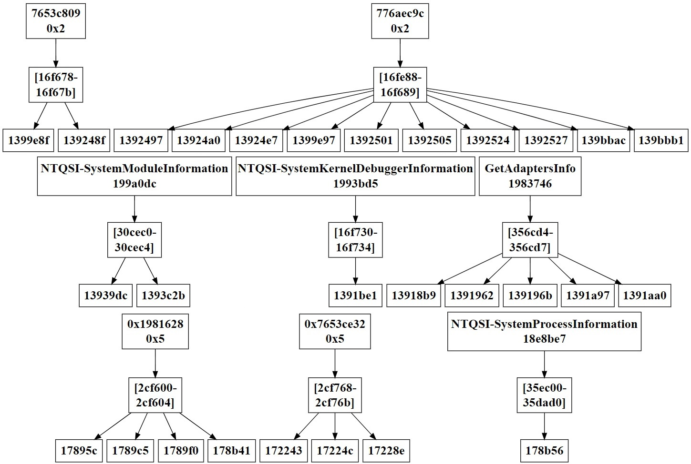

# WhiteRabbitTracker

**Last update: (July 25, 2021)** 

**WhiteRabbitTracker** is an open-source dynamic analysis framework which leverages dynamic binary instrumentation capabilities from [Intel Pin](https://software.intel.com/en-us/articles/pin-a-dynamic-binary-instrumentation-tool) and the dynamic taint analysis [libdft](https://www.cs.columbia.edu/~vpk/research/libdft/) library to build a profile of the evasive strategy employed by the executable under analysis, monitoring the interaction between the sample and the data it manipulates.

In particular, this framework taints the output data of APIs, system calls and suspected instructions that are routinely involved in evasive attempts, identifying tainted instructions and providing calling context information to help understanding where in the executable tainted data originates. In addition, this framework monitors these evasive attempts that a sample can make on the environment looking for artifacts, and fixes them when their results would give away the presence of an automated analysis or a human agent.

In fact, WhiteRabbitTracker considers system calls, functions and single instructions as **taint sources** (colouring their output using different **taint colors**) and any possible instruction involving tainted data as **taint sinks**. The **taint propagation policy** is handled by the libdft library using byte-sized tags to account for all the relationships between input and output operands.

We tested WhiteRabbitTracker on heterogeneous PE32 malware running on 32-bit Windows 7 SP1: as an example, we can run executables protected with recent versions of VMProtect and Obsidium, and highly evasive samples like Furtim.


### Requirements

WhiteRabbitTracker builds on Intel Pin (v3.15 is highly recommended) and requires Visual Studio 2015 or higher for its compilation.

Pin has some dependencies that require manual inclusion in the project. We created a `Locals.props` file that simplifies the project configuration. Its defaults are Pin being installed in `C:\Pin315` and the SDK 8.1 headers being in use: 

```
  <PropertyGroup Label="UserMacros">
    <PinFolder>C:\Pin315</PinFolder>
    <ZydisFolder>$(SolutionDir)deps\zydis</ZydisFolder>
    <WinHPath>C:\Program Files (x86)\Windows Kits\8.1\Include\um</WinHPath>
  </PropertyGroup>
```

For instance, if you wish to use the SDK 10.0.17763.0 headers, after modifying the Project settings in Visual Studio
you should also change the value of the `WinHPath` property to `C:\Program Files\Windows Kits\10\Include\10.0.17763.0\um`. Similarly, modify the property value if your SDK 8.1 headers are installed in `C:\Program Files\` instead of `C:\Program Files (x86)\`. The purpose of this field is to assist Pin when it includes the absolute path of `Windows.h` from its CRT headers.

In case of modifications concerning the Intel Pin path, the `LOGPATH` and `LOGPATH_TAINT` variables under the `bufferLoggingInfo.h` header file must be changed to adjust the logging process.

In addition, WhiteRabbitTracker also depends on the [Zydis](https://github.com/zyantific/zydis) decompiler. In fact, before compiling WhiteRabbitTracker, is necessary to compile the Zydis project under the `deps\zydis` folder in order to generate `Zydis.dll`, `Zycore.dll`, `Zydis.lib` and `Zycore.lib` in `deps\zydis\msvc\bin\DebugX86`.

You should now be able to compile WhiteRabbitTracker. Once compilation ends, you will find a `WhiteRabbitTracker32.dll` library in the Pin directory.

### Status for evasions

Below a list of evasive checks correctly tainted and countered by WhiteRabbitTracker during different tests on a Windows 7 SP1 32-bit VirtualBox machine for different executable protectors and armored samples:
Category | Instances
--- | --- 
Hypervisor | Guest additions, files, registry entries, libraries, and drivers from VirtualBox
Hardware | BIOS and firmware strings, MAC address, `cpuid`, disk size
Time | Slowdown detection using `rtdsc` and Windows time-related APIs
Software | Artifacts of common monitoring tools (running processes, GUI windows), parent process, frozen mouse cursor
Debugging | Single-step exceptions, `int 2d`, OS queries for active/installed debuggers (e.g. `NtQueryInformationProcess`), Process Entry Block fields
DBI | Pointer leaks with FPU instructions

### Quick start

To run an executable under WhiteRabbitTracker use:

```
C:\Pin315\pin.exe -t WhiteRabbitTracker32.dll [options] -- <file.exe>
```

WhiteRabbitTracker supports the following command-line options:

Option | Meaning
--- | --- 
`-trace` | Enable API tracing at instruction level after each tainted conditional branch
`-bypass` | Enable return value bypass for APIs and instructions to avoid sandbox/VM detection 
`-leak` | Enable bypass to avoid leaks of real EIP through FPU instructions
`-alertSystemCode` | Enable taint alert for tainted system code considering only the first tainted system instruction for each identified subroutine 

To specify the desired number of traced API for the `-trace` functionality, the `API_AFTER_TAINTED_BR` variable under the `bufferLoggingInfo.h` header file must be modified.

Furthermore, to enable or disable specific taint sources, the boolean variables under the `taint.h` header file must be modified. Instead, to customize the taint color of a specific taint source, the hooking procedures must be modified accessing the specific C++ files (i.e., `functions.cpp`, `syshooks.cpp` and `specialInstructions.cpp`).

The taint sinks identification can be analyzed and customized under the `libdft\bridge.cpp` C++ file.

For instance, to run an evasive program named `sample.exe` in a sandbox-like automatic mode try:

```
C:\Pin315\pin.exe -t WhiteRabbitTracker32.dll -bypass -leak -- sample.exe
```

WhiteRabbitTracker will create a file named `profile.log` under Pin's folder that logs all the identified context information (e.g., identified APIs after each tainted conditional branch, bypassed APIs/instructions and so on).

Furthermore, WhiteRabbitTracker will create a file named `callstack.log` under Pin's folder that logs all the subroutines identified during program execution.

In conclusion, WhiteRabbitTracker will produce three files for each thread generated during program execution under the `C:\Pin315\taint` folder:
* `tainted-<thread_identifier>.log` contains all the information related to the tainted instructions. In particular, the following information are stored in this file:
  * The type of tainted instruction identified by WhiteRabbitTracker(e.g., the label "mem-imm" stands for an instruction with two operands, respectively a memory address and an immediate value);
  * The address of the tainted instruction;
  * The taint color associated with the tainted instruction;
  * The operands involved in the tainted instruction;
  * The hash that uniquely identifies the subroutine associated to the tainted instruction;
  * In case the instruction is a tainted system instruction, this file includes also the tainted Windows API.
* `tainted-<thread_identifier>-ins.log` contains, for each tainted instruction, the disassembled version of that instruction using the Zydis decompiler;
* `tainted-<thread_identifier>-mem.log` keeps information about memory addresses tainted in a taint source (i.e., function/system call hooks or instruction hooks).

### Offline analysis

WhiteRabbitTracker provides a Python script under the `offlineAnalysis` folder to combine all the collected information through an abstraction (i.e., `producer-consumer graph`) which allows the analyst to quickly identify which entities are involded in these tracked data flows (e.g., subroutines that implement the evasive attempts). In particular, the `producer-consumer graph` is composed by three building blocks:
* `Producers`: The producer can be seen as the responsible for having caused data to become tainted. Always referring to the taint analysis jargon, in some instances a producer is exactly the taint source of the tainted flow;
* `Chunks`: A chunk is the memory object “created” by a producer and later manipulated by a consumer;
* `Consumers`: Ultimately, a consumer is any malware instruction which involved tainted data in its input operands (i.e., taint sinks).

In some instances, a producer can be identified through data movement operations and therefore would not match any taint source. In fact, WhiteRabbitTracker identifies producers of chunks created by movement operations, through the combination of the taint color and the hash that uniquely identifies the tainted subroutine (i.e., context identifier).

As an example, an analysis of a full run on the Furtim malware with the options `-bypass` and `-leak` will yield the following producer-consumer graph:



### Authors
* Andrea Naspi ([@andreanaspi](https://github.com/AndreaNaspi)) - main developer
* Daniele Cono D'Elia ([@dcdelia](https://github.com/dcdelia)) - thesis advisor
